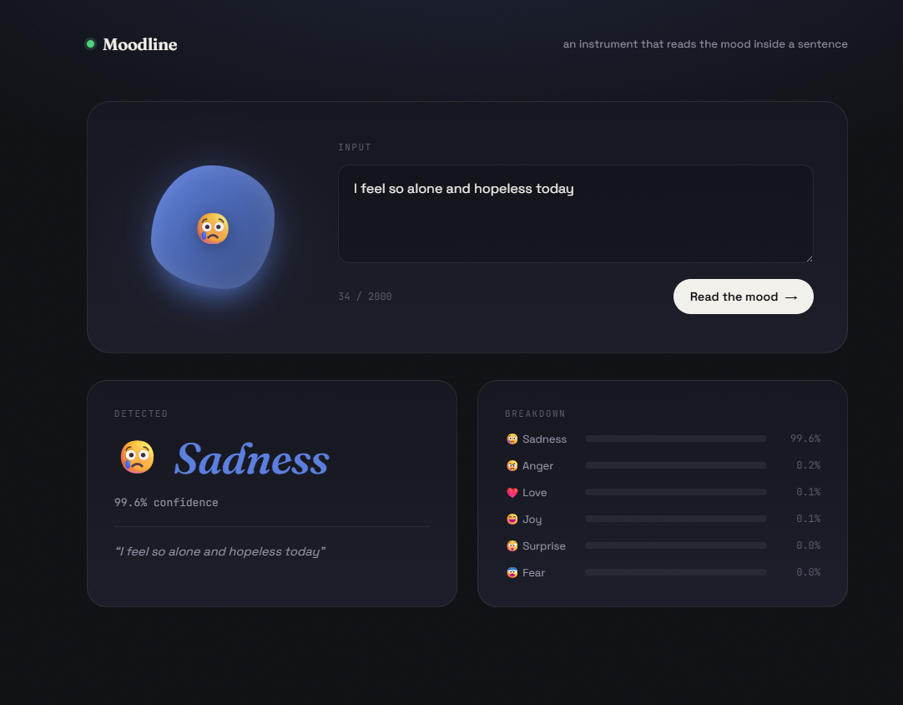
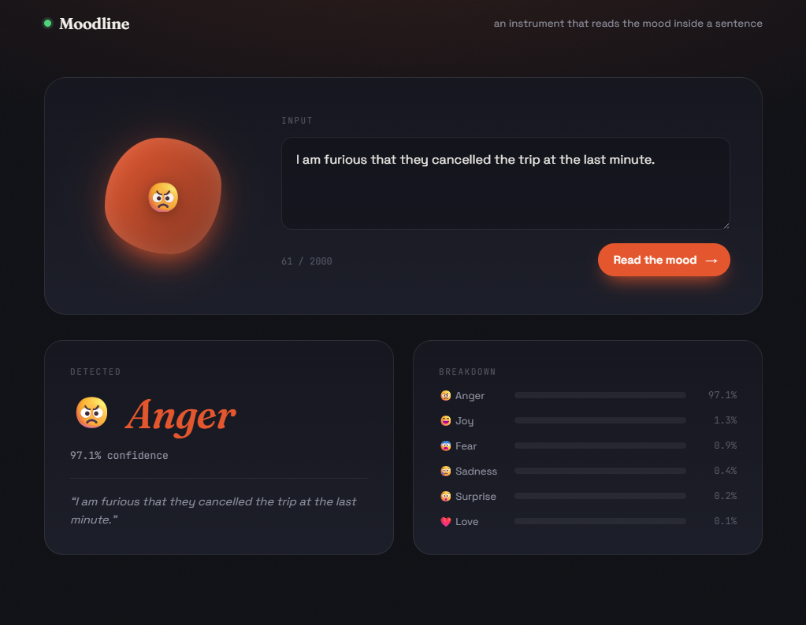
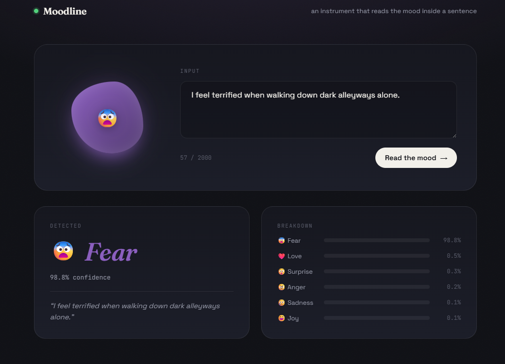
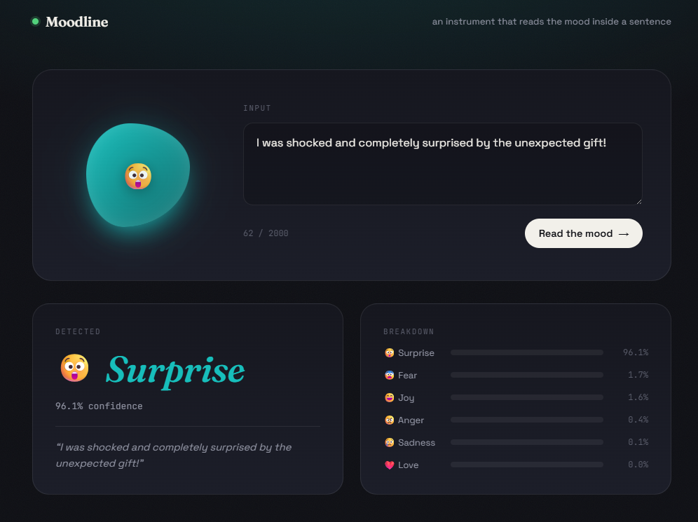

#  Moodline — Emotion Detection from Text

An end-to-end deep learning application that reads the emotion inside a sentence — from raw text, through a Bidirectional GRU model, to a live, styled web interface served entirely through FastAPI.

**Live Demo:** [deep-learning-powered-sentiment-analysis.onrender.com](https://deep-learning-powered-sentiment-analysis.onrender.com)
**Repository:** [github.com/Hardik-Rawat/Deep-Learning-Powered-Sentiment-Analysis-API](https://github.com/Hardik-Rawat/Deep-Learning-Powered-Sentiment-Analysis-API)


---

##  Overview

Moodline is a multi-class text emotion classifier that predicts one of six emotions — **sadness, joy, love, anger, fear, surprise** — from a sentence of free-form text, and returns a full confidence breakdown across all six classes.

The project covers the complete pipeline: data preprocessing and tokenization, training and benchmarking multiple recurrent architectures (RNN, LSTM, GRU, Bidirectional GRU), serving the best model through a production FastAPI backend, and presenting results through a custom-built, animated web UI — no separate frontend framework, everything is served directly by FastAPI.

##  Live Results

| Input | Detected | Confidence |
|---|---|---|
| *"I feel so alone and hopeless today"* | 😢 Sadness | 99.6% |
| *"I am furious that they cancelled the trip at the last minute."* | 😠 Anger | 97.1% |
| *"I feel terrified when walking down dark alleyways alone."* | 😨 Fear | 98.8% |
| *"I was shocked and completely surprised by the unexpected gift!"* | 😲 Surprise | 96.1% |

<p>
  
  
</p>
<p>
  
  
</p>

---

##  Model & Architecture

Trained and benchmarked on the [`dair-ai/emotion`](https://huggingface.co/datasets/dair-ai/emotion) dataset — 16,000 labeled English Twitter messages across six emotion classes, with a 15,213-word vocabulary after tokenization.

### Models compared

| Model | Test Accuracy | Test Loss |
|---|---|---|
| Simple RNN | 31.6% | 1.734 |
| LSTM | 11.2%* | 1.793 |
| GRU | 34.5% | 1.760 |
| **Bidirectional GRU (final)** | **92.6%** | **0.187** |

*\*Stopped early via `EarlyStopping` on validation loss.*

### Final architecture — Bidirectional GRU

```
Embedding(input_dim=10000, output_dim=300)
Bidirectional(GRU(128, return_sequences=True))
Dropout(0.5)
Bidirectional(GRU(64))
Dropout(0.5)
Dense(6, activation='softmax')
```

**Training setup:**
- Tokenization: Keras `Tokenizer` (vocab capped at 10,000 words, OOV token handling)
- Padding: fixed sequence length of 50 tokens (`post` padding & truncation)
- Class imbalance handled via computed `class_weight='balanced'`
- `EarlyStopping` on validation loss (patience = 3) to prevent overfitting
- Optimizer: Adam, loss: sparse categorical cross-entropy

---

##  Tech Stack

| Layer | Technology |
|---|---|
| Modeling | Python, TensorFlow / Keras (RNN, LSTM, GRU, Bidirectional GRU) |
| Data | Pandas, NumPy, Hugging Face `datasets` |
| Backend / API | FastAPI, Pydantic (request/response validation), Uvicorn |
| Frontend | Vanilla HTML/CSS/JS — custom UI served as static files via FastAPI |
| Deployment | Render |

---

##  How It Works

1. **Preprocessing** — incoming text is lowercased, apostrophes and special characters stripped, and whitespace normalized to match the training data's format.
2. **Tokenization & Padding** — text is converted to a sequence of token IDs using the saved `Tokenizer`, then padded/truncated to a fixed length of 50.
3. **Inference** — the padded sequence is passed through the trained Bidirectional GRU model, producing a softmax probability distribution over all 6 emotions.
4. **Response** — the API returns the top predicted emotion, its confidence score, and the full probability breakdown for all six classes.

### API Endpoints

| Method | Endpoint | Description |
|---|---|---|
| `GET` | `/` | Serves the web UI |
| `GET` | `/health` | Health check — reports whether the model is loaded |
| `POST` | `/predict` | Accepts text, returns predicted emotion + confidence breakdown |

**Example request:**
```json
POST /predict
{
  "text": "I feel terrified when walking down dark alleyways alone."
}
```

**Example response:**
```json
{
  "text": "I feel terrified when walking down dark alleyways alone.",
  "predicted_emotion": "fear",
  "confidence": 0.988,
  "all_probabilites": {
    "sadness": 0.001,
    "joy": 0.001,
    "love": 0.005,
    "anger": 0.002,
    "fear": 0.988,
    "surprise": 0.003
  }
}
```

The model and tokenizer are loaded once at startup using FastAPI's `lifespan` context manager, rather than on every request, for fast response times in production.

---

##  Project Structure

```
.
├── Artifacts/
│   ├── BiGRU_Model.keras       # trained model
│   └── tokenizer.pkl           # fitted Keras tokenizer
├── static/
│   ├── index.html              # UI markup
│   ├── style.css                # UI styling (per-emotion color themes)
│   └── script.js                # UI logic — API calls, animations
├── notebook/
│   └── final_clean.ipynb       # data prep, model training & evaluation
├── main.py                      # FastAPI application
├── requirements.txt
└── runtime.txt
```

---

##  Setup & Run Locally

**1. Clone the repository**
```bash
git clone https://github.com/Hardik-Rawat/Deep-Learning-Powered-Sentiment-Analysis-API.git
cd Deep-Learning-Powered-Sentiment-Analysis-API
```

**2. Create a virtual environment and install dependencies**
```bash
python -m venv venv
source venv/bin/activate     # Windows: venv\Scripts\activate
pip install -r requirements.txt
```

**3. Run the server**
```bash
uvicorn main:app --reload
```

**4. Open the app**
```
http://127.0.0.1:8000
```

---

## Deployment

Live on **[Render](https://render.com)**: [deep-learning-powered-sentiment-analysis.onrender.com](https://deep-learning-powered-sentiment-analysis.onrender.com)

- Runtime: Python 3.11.9 (`runtime.txt`)
- Build command: `pip install -r requirements.txt`
- Start command: `uvicorn main:app --host 0.0.0.0 --port $PORT`
- Model and tokenizer artifacts are loaded once at server startup via FastAPI's lifespan handler.

---

##  Possible Improvements

- Swap in a pretrained transformer (e.g., DistilBERT) for higher accuracy on nuanced/mixed emotions
- Add multi-language support
- Add request rate limiting and input sanitization for production hardening
- Cache repeated predictions

---

##  Acknowledgements

Dataset: [`dair-ai/emotion`](https://huggingface.co/datasets/dair-ai/emotion) (Saravia et al., EMNLP 2018 — CARER: Contextualized Affect Representations for Emotion Recognition)

---

##  Author
Hardik Rawat

**Hardik Rawat**
B.Tech, Computer Science & Engineering (Data Science) — Manipal Institute of Technology, Bengaluru

[](https://www.linkedin.com/in/hardikrawat0309/)
[](https://github.com/Hardik-Rawat)
